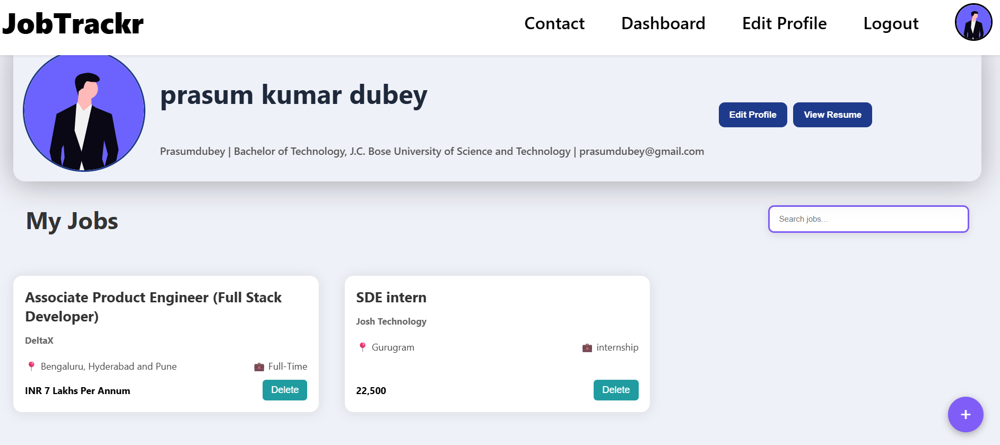

# 🚀 JobTrackr – Job Application Tracker  

JobTrackr is a **full-stack job application tracking system** that helps users manage their job search journey in one place. It allows you to save job postings, track application status, update progress, and stay organized with a clean dashboard. 

Glimpses of the Application's dashboard is:


---

## ✨ Features  

- 🔐 **Authentication** – Secure signup/login using JWT & refresh tokens  
- 📋 **Job Management** – Add, update, and delete job applications  
- 📊 **Dashboard** – View all your applications at a glance  
- 👤 **Profile Section** – Manage user details and preferences  (Resume upload & quick access)
- 📝 **Status Tracking** – Track jobs 
- 📈 **Future Scope**  
  - Notes/reminders for each job  
  - Analytics on applications (success rate, stage distribution)  
  - Auto-fetch job descriptions from job portals  

---

## 🛠 Tech Stack  

**Frontend:**  
- React.js  
- Axios (for API requests)  
- React Router (protected routes)  

**Backend:**  
- Node.js + Express  
- MongoDB + Mongoose (database)  
- JWT Authentication (Access + Refresh tokens)  
- bcrypt (for password hashing)  
- dotenv (for environment variables)   

**Others**
- Azure
- OpenAI (ChatGPT Services)

---

## ⚙️ Installation & Setup  

### 1️⃣ Clone the Repository  
Open Terminal and write these command
```bash
git clone https://github.com/prasumdubey/Job-trackr.git
cd trackr
```

### 2️⃣ Backend Setup (Node.js + Express)
```bash
cd server
npm install
node app.js
```

### 3️⃣ Create a .env file in backend/ and add:
```bash
PORT=your_port
MONGO_URI=your_mongodb_connection_string
JWT_SECRET=your_secret_key
AZURE_OPENAI_API_KEY=your_Azure_OpenAI_Key
AZURE_OPENAI_ENDPOINT=your_Azure_OpenAI_Endpoints
AZURE_OPENAI_DEPLOYMENT_ID=your_Azure_OpenAI_Deployment_ID
AZURE_OPENAI_API_VERSION=your_Azure_OpenAI_API_Version
```

### Frontend Setup (React)
Open another Terminal and write these commands
```bash
cd trackr\forntend
npm install
npm run dev
```

## 🖥 Usage

- Sign up or log in to your account
- Add job applications with details (Company, Role, Status, Description)
- Track your progress directly from the dashboard
- Update status as you move through application stages


## 🤝 Contributing

- Contributions are welcome!
- Fork the repo
- Create a new branch (feature/your-feature)
- Commit your changes
- Open a Pull Request

## 📜 License

This project is licensed under the MIT License.
